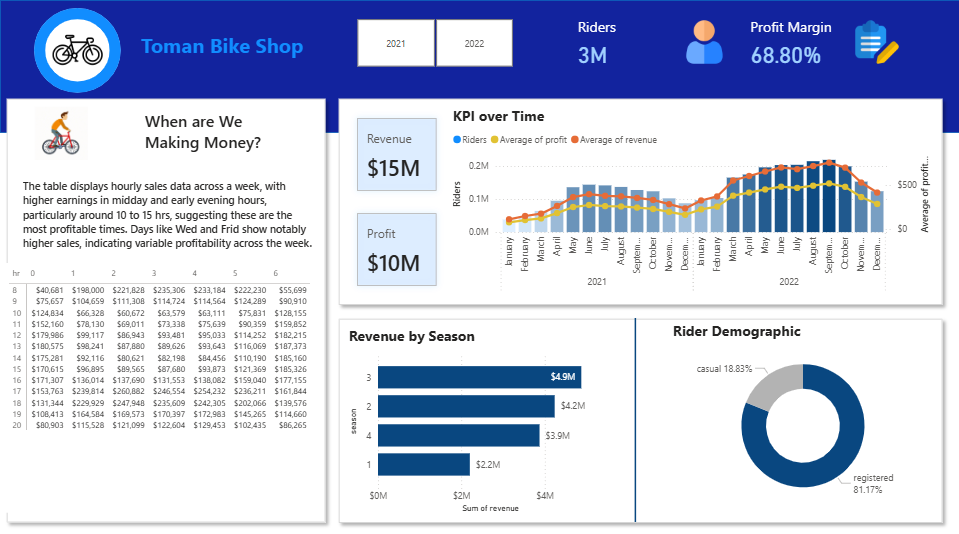

# -Toman-Bike-Share-Revenue-Profit-Analysis-2021-2022-
🚴‍♂️ Toman Bike Share – Revenue & Profit Analysis (2021–2022)
Overview
This project analyzes the Toman Bike Share dataset to uncover revenue, profit, and ridership trends, providing actionable business insights for pricing and demand strategies.

Tools Used:

SQL Server – Data cleaning, transformation, and metric calculation

Power BI – Interactive dashboards and visualization

1. Data Preparation in SQL
Converted dteday to proper datetime2 format

Standardized data types (e.g., riders → float)

Combined 2021 & 2022 datasets

Calculated:

Revenue = riders * price

Profit = revenue - (COGS * riders)

Example SQL Snippet:

sql
Copy
Edit
with cte as (
    select * from bike_share_yr_0
    union all 
    select * from bike_share_yr_1
)
select 
    dteday,
    season,
    c.yr,
    weekday,
    hr,
    rider_type,
    riders,
    price,
    COGS,
    riders * price as revenue,
    riders * price - COGS * riders as profit
from cte c
left join cost_table ct on ct.yr = c.yr;
2. Power BI Dashboard Features
KPI Cards: Total Revenue, Profit, Riders, Profit Margin

Trends Over Time: Riders, Revenue, Profit trends by month

Hourly Revenue Analysis: Peak profitability hours

Seasonal Revenue: Comparative performance by season

Rider Demographics: Casual vs Registered distribution

Business Insight Summary: Automatically generated from measures

3. Key Insights (2021–2022)
Price Impact: $3.99 → $4.99 (+25%)

Demand Impact: 1.24M → 2.05M riders (+65%)

Revenue Impact: $4.96M → $10.23M (+106%)

Profit Impact: $3.42M → $7.03M (+106%)

4. Files in This Repo
SQL_Scripts/ – All data cleaning & transformation scripts

PowerBI_Dashboard/ – .pbix file with visualizations

README.md – Project documentation

## 📊 Dashboard Preview

💡 Key Takeaway:
Maintaining operational efficiency while leveraging strategic pricing can sustain growth and improve profitability.
